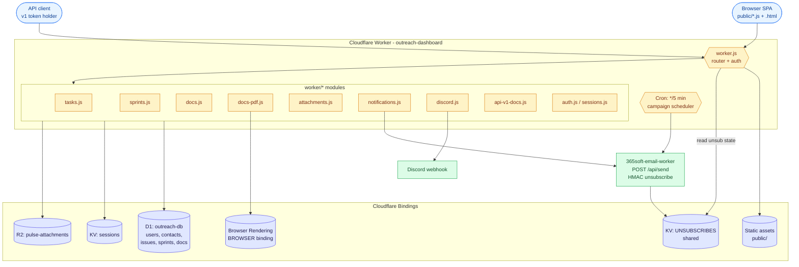

# 365Pulse

A single Cloudflare Worker hosting an integrated workspace: AI outreach, CRM, project & issue tracking, sprints, and a Confluence-style docs / wiki — all on Cloudflare's edge platform.

> Deployed as the Worker `outreach-dashboard`. The codebase originally started as an outreach dashboard and has grown into a full workspace product.

---

## What's inside

| Area | Highlights |
|---|---|
| **Outreach** | HTML email templates, contacts (with CSV import), lists, multi-step campaigns (immediate / scheduled / recurring / drip), unsubscribe handling shared with the email worker |
| **CRM** | Kanban pipeline across 6 stages, follow-up tracking, contact drawer with typed activity log + full email history |
| **Tasks / Issues** | Projects, issues with custom fields, dependencies, start & due dates, full-page issue view, Jira-style board, comments with @mention, issue cloning |
| **Sprints** | Sprint planning, active-sprint overview, kanban filtered by sprint |
| **Docs / Wiki** | Spaces, slug-based page URLs, Confluence-style sidebar, wiki-link autocomplete `[[Space/Page]]`, Mermaid diagrams, server-side PDF export with page numbers, programmatic publishing via v1 API |
| **Attachments** | R2-backed file storage on issues and pages, in-app modal preview for docx/xlsx/csv/pdf/video/audio/JSON/text |
| **Notifications** | In-app + email + Discord integration, @mention notifications, click-through to the source issue or page |
| **Auth & users** | Session login, TOTP 2FA with backup codes, user avatars, password change, admin-managed users |
| **Admin** | Feature visibility toggles, API tokens for the v1 API, Discord webhook config |

---

## Architecture



### Stack

- **Runtime:** Cloudflare Worker, vanilla JS, no build step
- **Frontend:** vanilla JS + HTML in `public/` (router, SPA-style hash URLs)
- **Database:** D1 (`outreach-db`)
- **KV:** `KV` for sessions, `UNSUBSCRIBES` shared with `365soft-email-worker`
- **R2:** `pulse-attachments` for issue/page files
- **Browser Rendering:** `BROWSER` binding for server-side PDF export of doc pages
- **Cron:** every 5 minutes — campaign scheduler
- **Auth:** session token in KV (7-day TTL); optional TOTP 2FA per user

### Repo layout

```
worker.js                  Main entry — router, auth gate, cron handler, outreach + CRM endpoints
worker/                    Feature modules
  tasks.js                 Projects + issues + custom fields
  sprints.js               Sprint CRUD + board
  docs.js                  Doc spaces + pages + wiki-links
  docs-pdf.js              Server-side PDF rendering via Browser Rendering
  attachments.js           R2 upload / download / preview
  notifications.js         In-app + email notifications
  discord.js               Discord webhook integration
  api-v1-docs.js           Public v1 API for programmatic docs publishing
  api-tokens.js            Admin token issuance
  app-settings.js          Feature visibility flags
  custom-fields.js         Per-project custom field definitions
  dependencies.js          Issue dependency graph
  entity-links.js          Cross-entity links
  events.js                Activity timeline events
  integrations.js          Integration config
  auth.js / sessions.js    Login, TOTP, password change
public/                    SPA, CSS, UI modules
migrations/                Numbered SQL migrations (001 → 014+)
schema.sql                 Authoritative schema
wrangler.toml              Bindings + cron + custom domain config
```

---

## Setup

### 1. Install Wrangler & log in
```bash
npm install -g wrangler
wrangler login
```

### 2. Create / link bindings

```bash
# D1 database
wrangler d1 create outreach-db
# → paste database_id into wrangler.toml [[d1_databases]]

# Sessions KV
wrangler kv:namespace create SESSIONS
# → paste id into wrangler.toml [[kv_namespaces]] (binding="KV")

# Shared unsubscribe KV — re-use the email worker's namespace ID
wrangler kv:namespace list
# → paste UNSUBSCRIBES id into wrangler.toml [[kv_namespaces]] (binding="UNSUBSCRIBES")

# R2 bucket for attachments
wrangler r2 bucket create pulse-attachments
```

Browser Rendering is enabled via the `[browser]` block in `wrangler.toml` — no separate command.

### 3. Apply migrations

```bash
# Fresh install — apply schema
wrangler d1 execute outreach-db --file=schema.sql

# OR apply numbered migrations in order
for f in migrations/*.sql; do wrangler d1 execute outreach-db --file=$f; done
```

### 4. Set secrets

```bash
wrangler secret put ADMIN_USER
wrangler secret put ADMIN_PASS
wrangler secret put CF_ACCESS_CLIENT_ID       # optional — Cloudflare Access for email worker
wrangler secret put CF_ACCESS_CLIENT_SECRET   # optional — Cloudflare Access for email worker
```

On the **email worker** side (one-time):
```bash
wrangler secret put MAIL_UNSUBSCRIBE_BASE_URL --name 365soft-email-worker
wrangler secret put MAIL_UNSUBSCRIBE_NOTIFY_EMAIL --name 365soft-email-worker
```

### 5. Deploy

```bash
wrangler deploy
```

---

## Feature reference

### CRM pipeline stages

| Stage | Meaning |
|---|---|
| Lead | Initial contact, not yet qualified |
| Prospect | Engaged, showing interest |
| Qualified | Confirmed need and budget |
| Proposal | Proposal or quote sent |
| Won | Deal closed |
| Lost | Not proceeding |

Pipeline value on the Overview counts all active (non-Won, non-Lost) contacts.

### Activity log types

`note`, `call`, `meeting`, `email`. `last_contacted_at` updates automatically when a campaign send succeeds.

### Email merge tags

| Tag | Resolved by | Value |
|---|---|---|
| `{{name}}` | Outreach worker | Contact's name (fallback: "there") |
| `{{email}}` | Outreach worker | Contact's email |
| `{{company}}` | Outreach worker | Contact's company |
| `{{unsubscribe_url}}` | Email worker | HMAC-signed link (auto) |
| `{{physical_address}}` | Email worker | From `MAIL_PHYSICAL_ADDRESS` secret |

Always include an unsubscribe link — the email worker resolves the URL automatically:
```html
<p style="font-size:11px;color:#888;text-align:center;margin-top:32px">
  <a href="{{unsubscribe_url}}" style="color:#888">Unsubscribe</a>
</p>
```

### Campaign schedule types

| Type | Behaviour |
|---|---|
| Immediate | Draft mode — manual send |
| Once | Fires automatically at the configured time |
| Recurring | Repeats on a fixed-day interval |
| Drip | Per-contact enrolment, configurable inter-step delays |

The cron trigger runs every 5 minutes and processes all active scheduled campaigns. If a contact unsubscribes mid-drip, the email worker returns `403 RECIPIENT_UNSUBSCRIBED`; the outreach worker logs `skipped` and stops that contact's drip.

### CSV import format

```csv
email,name,company,stage,deal_value,phone
nick@example.com,Nick Smith,Acme Corp,prospect,5000,+61400000000
jane@example.com,Jane Doe,Beta Inc,lead,,
```

`email` required; everything else optional.

### Docs / Wiki

- Spaces hold pages; pages have slug-based URLs and a parent–child tree
- Wiki-link autocomplete: `[[Space/Page]]` (or `[[Page]]` within the same space)
- Mermaid code fences render as diagrams in both the in-app reader and exported PDFs
- Page export → server-side PDF via Browser Rendering, including page-numbered footer
- Move-page modal supports re-parenting across the tree
- @mentions in comments raise a notification with deep-link

### Server-side PDF

`GET /api/doc-pages/:id/pdf` — uses `@cloudflare/puppeteer` against the `BROWSER` binding to render the page, then injects page numbers via the print footer template. Mermaid is rendered before the PDF is captured so diagrams appear in the export.

---

## API

All `/api/*` endpoints (except `/api/auth/*`) require either `Authorization: Bearer {sessionToken}` from the SPA or, for the **public v1 API**, an admin-issued token managed in Settings.

### Auth
| Method | Path | Notes |
|---|---|---|
| POST | `/api/auth/login` | `{username, password}` → `{token}` or `{require_totp:true}` |
| POST | `/api/auth/totp/login` | `{token, code}` → `{token}` |
| POST | `/api/auth/totp/login-backup` | `{token, backup_code}` → `{token}` |
| POST | `/api/auth/totp/setup` | Begin TOTP enrolment |
| POST | `/api/auth/totp/verify` | Confirm TOTP enrolment |
| POST | `/api/auth/totp/disable` | Remove TOTP |
| POST | `/api/auth/backup-codes/regenerate` | New set of single-use codes |
| POST | `/api/auth/password/change` | `{current, new}` |
| GET | `/api/auth/check` | Session check |
| POST | `/api/auth/logout` | Invalidate current session |

### Me / users
| Method | Path |
|---|---|
| GET | `/api/me` |
| PATCH | `/api/me/preferences` |
| POST | `/api/me/avatar` |
| GET | `/api/me/saved-filters` / PUT same |
| GET | `/api/me/my-issues` |
| GET | `/api/me/notifications` |
| GET / POST | `/api/users` |
| GET | `/api/users/mention-search?q=` |

### Outreach
Templates, contacts, lists, campaigns, logs, unsubscribes — full CRUD as before.
`GET /api/contacts?q=&stage=`, `POST /api/contacts/import` (CSV), `POST /api/campaigns/:id/send`, etc.

### CRM
| Method | Path |
|---|---|
| GET | `/api/crm/pipeline` |
| GET | `/api/crm/stats` |
| GET | `/api/crm/followups` |
| GET / PATCH | `/api/crm/contact/:id` |
| GET / POST | `/api/crm/contact/:id/notes` |
| DELETE | `/api/crm/contact/:id/notes/:noteId` |

### Tasks / sprints
| Method | Path |
|---|---|
| `/api/projects` | Project CRUD + per-project custom fields |
| `/api/issues` | Issue CRUD, dependencies, comments, clone |
| `/api/sprints` | Sprint CRUD + board |
| `/api/overview/active-sprints` `/due-soon` `/recent-activity` `/team-workload` | Dashboard widgets |

### Docs
| Method | Path |
|---|---|
| `/api/doc-spaces` | Space CRUD |
| `/api/doc-pages` | Page CRUD, move, comments |
| GET | `/api/doc-pages/:id/pdf` | Server-side PDF |

### Attachments / search / linking
| Method | Path |
|---|---|
| GET / POST / DELETE | `/api/attachments` |
| GET / POST / DELETE | `/api/entity-links` |
| GET | `/api/entity-search?q=` |
| GET | `/api/search?q=` |

### Public v1 API (token-auth, programmatic publishing)

```
POST   /api/v1/docs/pages              Create or upsert a page
GET    /api/v1/docs/pages?space=&slug= Fetch a page by slug
DELETE /api/v1/docs/pages?space=&slug= Delete a page
```

Tokens are issued in **Settings → API tokens** (admin only).

---

## Security notes

- Login credentials and provider keys live as Cloudflare secrets — never in source or `wrangler.toml`
- Sessions are KV-stored with a 7-day TTL; logout invalidates the token immediately
- Optional TOTP 2FA per user, with single-use backup codes
- Public v1 API tokens are scoped, hashed at rest, and revocable
- `/api/*` returns `401` for any unauthenticated request
- Unsubscribe page lives on the email worker and is HMAC-SHA256 signed
- No third-party analytics in the dashboard

---

## Maintenance

```bash
# Redeploy
wrangler deploy

# Live request logs
wrangler tail

# Database queries
wrangler d1 execute outreach-db --command="SELECT stage, COUNT(*) FROM contacts GROUP BY stage"

# Apply a new migration
wrangler d1 execute outreach-db --file=migrations/015_your_change.sql

# Inspect KV
wrangler kv:key list --namespace-id $SESSIONS_KV_ID
wrangler kv:key list --namespace-id $UNSUBSCRIBES_KV_ID --prefix "unsub:"

# R2
wrangler r2 object list pulse-attachments
```

---

## Related workers

- **`365soft-email-worker`** — outbound email, HMAC unsubscribe, owns `UNSUBSCRIBES` KV. 365Pulse only reads from that KV; all writes happen on the email worker.
